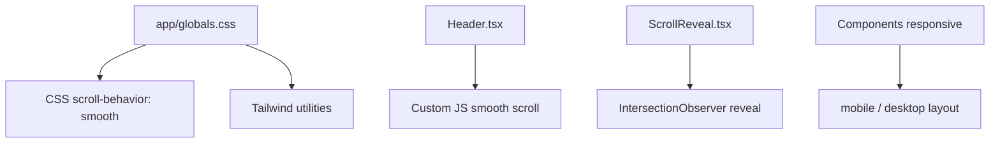

# Project Flow Summary

## 1. Flow Internationalization (i18n)

### Bagaimana `i18n/request.ts` bekerja dengan folder `app/[locale]`

- `i18n/request.ts` menggunakan `getRequestConfig` dari `next-intl/server`.
- Fungsi ini:
  - membaca `requestLocale`
  - menggunakan default `id` bila `requestLocale` tidak tersedia
  - mengimpor pesan dari `../messages/${locale}.json`
  - mengembalikan objek `{ locale, messages }`

- `app/[locale]/layout.tsx`:
  - menerima parameter `locale`
  - memanggil `getMessages({ locale })`
  - membungkus semua child route dengan `NextIntlClientProvider`
  - memastikan seluruh halaman di dalam `app/[locale]/*` mendapat konteks locale dan terjemahan

- `middleware.ts`:
  - menggunakan `next-intl/middleware`
  - melindungi route admin
  - tidak menerapkan i18n middleware pada `/login`, `/api`, atau file statis
  - menerapkan i18n middleware pada route publik seperti `/`, `/id/...`, `/en/...`

### Alur i18n

```mermaid
flowchart TD
  A[Request Public Route] --> B[middleware.ts]
  B -->|Public route| C[next-intl middleware]
  C --> D[i18n/request.ts]
  D --> E[app/[locale]/layout.tsx]
  E --> F[app/[locale]/page.tsx]
  E --> G[app/[locale]/portfolio/[id]/page.tsx]
```


## 2. Flow Autentikasi & Admin

### `actions/auth.ts`

- `loginAction(email, password)`:
  - berjalan di server (`use server`)
  - memanggil `supabase.auth.signInWithPassword`
  - bila berhasil, menyimpan token dalam cookie `sb-access-token`
  - cookie dibuat dengan `path: "/"`, `maxAge`, `sameSite: "lax"`, dan `secure` hanya di production

- `logoutAction()`:
  - memanggil `supabase.auth.signOut()`
  - menghapus cookie `sb-access-token`

### `app/login/page.tsx`

- sebuah client component dengan form login
- menyimpan `email`, `password`, `loading`, dan `error`
- mengeksekusi `loginAction`
- jika sukses, langsung redirect ke `/admin/dashboard`
- menampilkan pesan error bila gagal

### Proteksi folder `app/admin`

- `middleware.ts` memeriksa semua route dengan prefix `/admin`
- bila cookie `sb-access-token` tidak ada:
  - redirect ke `/login`
- bila cookie ada:
  - izinkan akses ke halaman admin

### Alur autentikasi admin

```mermaid
flowchart TD
  A[Login Page (/login)] -->|submit| B[actions/auth.ts: loginAction]
  B -->|Supabase Auth| C[supabase.auth.signInWithPassword]
  C -->|success| D[cookie sb-access-token]
  D --> E[/admin/dashboard]

  subgraph AdminGuard
    F[middleware.ts]
  end

  E --> F
  F -->|cookie valid| G[admin/dashboard or admin/view]
  F -->|cookie missing| H[/login]
```


## 3. Flow Data Portfolio

### `actions/portfolio.ts`

- menyediakan helper server untuk data portfolio dan profil:
  - `getProjects()`
  - `getProfile()`
  - `createProject()`, `updateProject()`, `deleteProject()`
  - `getSkills()`, `createSkill()`, `updateSkill()`, `deleteSkill()`
  - `getResumeData()`, `updateResumeProfile()`, `createResumeSkill()`, dll.

- `getProjects()`:
  - query tabel `projects`
  - `.select("*").order("id", { ascending: true })`
  - mengembalikan `{ success, data, error }`

- `getProfile()`:
  - query tabel `profile`
  - `.eq("id", 1).single()`

### Halaman utama `app/[locale]/page.tsx`

- mengambil `locale` dari `params`
- memanggil `getProjects()` dan `getProfile()`
- mengoper data ke komponen:
  - `Hero`
  - `About`
  - `Skills`
  - `Resume`
  - `Portfolio`
  - `Contact`

- komponen `Portfolio` menerima `projects` sebagai props

### Halaman detail `app/[locale]/portfolio/[id]/page.tsx`

- mengambil `id` dan `locale` dari `params`
- langsung query Supabase:
  - `supabase.from("projects").select("*").eq("id", id).single()`
- bila data tidak ditemukan, memanggil `notFound()`
- menampilkan konten sesuai bahasa locale
- menampilkan gallery apabila `gallery_urls` tersedia

### Alur data portfolio

```mermaid
flowchart TD
  A[app/[locale]/page.tsx] -->|getProjects()| B[actions/portfolio.ts]
  A -->|getProfile()| C[actions/portfolio.ts]
  B --> D[Supabase projects table]
  C --> E[Supabase profile table]
  A --> F[Portfolio component]
  F -->|link detail| G[app/[locale]/portfolio/[id]/page.tsx]
  G -->|fetch by id| D
```


## 4. Flow Front-End (Responsive & Smooth Scroll)

### Smooth scrolling di `app/globals.css`

- `globals.css` mengimpor Tailwind dengan `@import "tailwindcss";`
- menambahkan:
  - `html { scroll-behavior: smooth; scroll-padding-top: 80px; }`
  - `body { scroll-behavior: smooth; scroll-padding-top: 80px; }`
- kesimpulan: smooth scrolling dasar di-handle oleh CSS, bukan library eksternal

### `ScrollReveal.tsx`

- komponen client dengan:
  - `IntersectionObserver`
  - `useState`, `useEffect`, `useRef`
- saat elemen terlihat di viewport:
  - `setIsVisible(true)`
  - unobserve elemen
- menambahkan kelas transisi Tailwind:
  - `opacity-100 translate-y-0 blur-0`
  - dari awal `opacity-0 translate-y-12 blur-[1px]`
- tidak menggunakan Framer Motion, AOS, atau library animasi besar
- efeknya murni custom reveal berbasis intersection observer + CSS transition

### Smooth scroll di `Header.tsx`

- `Header` mengimplementasikan custom scroll dengan JS
- fungsi `handleSmoothScroll(...)`:
  - menghitung posisi target
  - memperhitungkan offset header sticky 80px
  - menggunakan `requestAnimationFrame`
  - easing `easeInOutQuad`
- ini menambah smooth scroll lebih halus di menu link internal

### Responsiveness UI di `app/components`

- `Header.tsx`:
  - `hidden xl:flex`
  - `md:flex`
  - responsive layout untuk mobile dan desktop
- `Hero.tsx`:
  - `grid grid-cols-1 lg:grid-cols-12`
  - `order-2 lg:order-1`
  - `text-4xl md:text-5xl lg:text-6xl`
- `Portfolio.tsx`:
  - `grid grid-cols-1 md:grid-cols-2`
  - `overflow-x-auto` untuk tab filter mobile
  - `md:px-12`, `sm:flex-row`, `gap-8`
- kesimpulan: sudah menggunakan utility responsive Tailwind secara konsisten

### Ringkasan Front-End



---

## Catatan penting

- Proteksi admin dijalankan di `middleware.ts`, bukan hanya di tingkat React.
- `loginAction` mengatur cookie Supabase, lalu `app/login/page.tsx` men-trigger redirect.
- `app/[locale]/portfolio/[id]/page.tsx` melakukan fetch Supabase langsung di halaman, bukan lewat action helper.
- `ScrollReveal.tsx` merupakan solusi animasi internal tanpa dependency eksternal.
